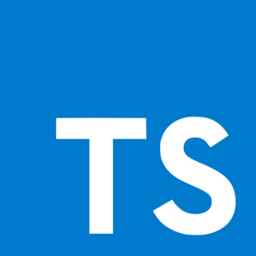
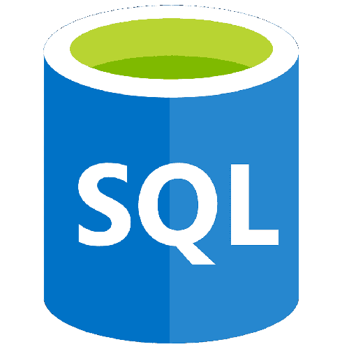

## Hey there! 

### 🤵 Who am I?

<!-- 

 -->

#### 😄 Social
|  |  |  |
|------|---|---|

#### ⌨ Languages/Frameworks

|  |  |  |  |  |  |  |
|------|---|---|---|---|---|---|

#### 🔧 Tools

|| |||  |  |  |
|------|---|---|---|---|---|---|
